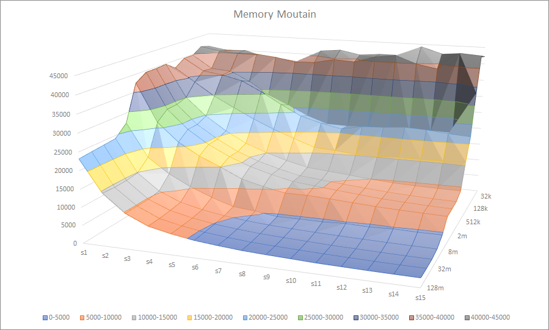

# 6-44
首先看运行结果，

    Clock frequency is approx. 3601.9 MHz
    Memory mountain (MB/sec)
            s1	s2	s3	s4	s5	s6	s7	s8	s9	s10	s11	s12	s13	s14	s15	
    128m	23447	14990	10012	7281	5778	4828	4180	3718	3430	3159	3001	2836	2726	2638	2582	
    64m	    23084	14850	10119	7430	5967	4933	4281	3793	3492	3241	3010	2868	2751	2645	2601	
    32m	    24509	15076	10240	7366	6049	5062	4296	3729	3570	3316	3067	2910	2822	2700	2658	
    16m	    24424	15347	10416	7763	6297	5239	4581	4089	3917	3736	3516	3306	3252	3080	3111	
    8m	    26862	17637	13401	10272	8348	6658	5717	5265	5044	4947	4830	4730	4850	4723	4743	
    4m	    37735	27178	21990	18144	15188	12912	10835	9617	9383	9059	8637	8192	7907	7758	7663	
    2m	    39008	28663	23241	19165	16025	13767	11951	10622	10122	9448	8907	8490	8167	7905	7756	
    1024k	39481	29186	23503	19509	16358	14066	12250	10847	10219	9626	9035	8505	8184	7927	7794	
    512k	39566	29283	23641	19713	16498	14215	12383	11002	10447	9845	9343	8997	8904	8831	9052	
    256k	40843	34055	30430	27289	23952	21320	18716	16652	16501	16302	16365	16663	16292	17440	17345	
    128k	41890	38277	37115	35852	32126	28938	24822	22362	21720	21391	21426	21977	21174	20919	21194	
    64k	    41928	37975	36751	35043	31039	27587	24923	21971	21391	22163	20532	22101	20470	22273	32247	
    32k	    41355	31323	40851	42152	41628	41498	40627	40643	40341	40410	44693	40633	39810	44832	42753	
    16k	    42825	42517	39817	39447	40830	39650	45072	43909	43996	44360	44324	42022	42415	42142	41403

可以看到最高吞吐量达到45+GB/s，s1步长的吞吐量下降比较缓慢，也是书上所说得益于i7的硬件prefetching，一直到4m都还保持着接近40000MB/s的速度

我用windows的office生成了关于步长，数据大小和吞吐量的曲面图（必须吐槽下libreoffice真的不好用...也因此导致曲面图的数据和上面不太一样，不过懒得再改了，反正差不多）

我们可以看到在是步长比较大的时候，可以明显看出吞吐量大致可以分为四个阶段，最高峰的64k-，中高峰的64k\~512k，较低峰的512k\~8m，最低谷的8m+

所以分别推测了l1缓存，l2缓存，l3缓存的大小分别是64k, 512k和8m

查阅intel文档只看到了说有6m的l3缓存，然后我们在wikichip上看到我们有4个32k的l1d缓存，4个32k的l1i缓存，即128k的l1数据缓存，4\*256k的l2缓存，即1m的l2缓存，4\*1.5m的l3缓存，即6m的l3缓存，emmm跟我的预测差好多hhh

现在回头来看输出的数据，可以看到32k-的时候有着40+GB/s的高速，超过32k后明显下降（一开始我觉得64k算是一个过渡期，所以当做分界点了，但是看数据很明显，除了15步长和小步长64k都明显远远低于32k和16k），256k是第二个分界点，超过他之后，吞吐量再次几乎减半，最后的分界点在4m，超过4m达到8m之后吞吐量再次几乎减半。从以上分析来看可以发现分界点与单核的l1d和l2缓存大小和总体的l3缓存大小接近或者一致。

